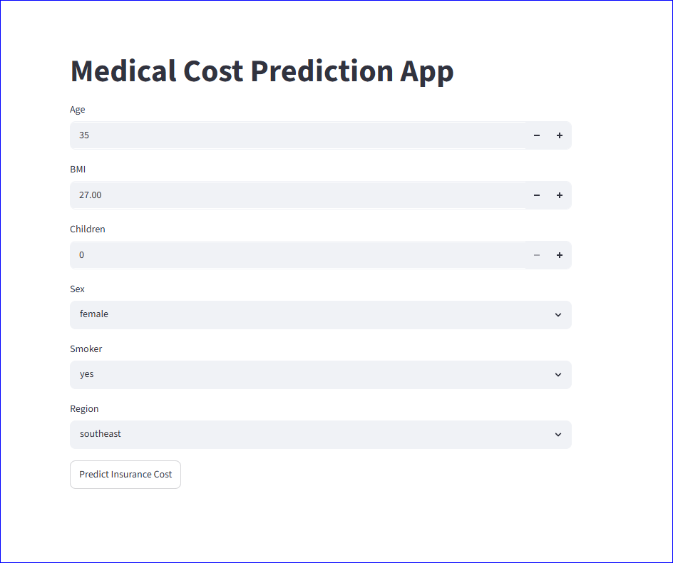
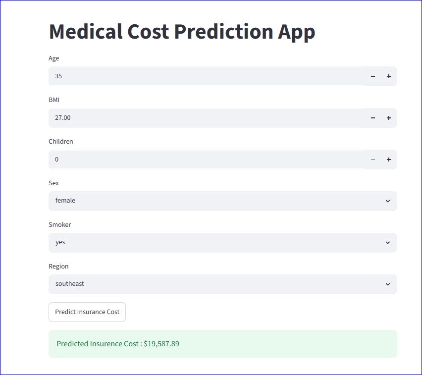

# Medical Cost Prediction using Machine Learning

## Project Overview

This project is an end-to-end Machine Learning application that predicts individual medical insurance charges based on demographic and health-related attributes. The system uses supervised regression models to estimate insurance costs and is deployed as an interactive web application using Streamlit.

The goal is to demonstrate a full ML pipeline: data analysis, preprocessing, model training, evaluation, and deployment.

---

## Problem Statement

Medical insurance costs vary significantly depending on factors such as age, BMI, smoking status, and lifestyle.  
The objective is to build a regression model that can accurately estimate insurance charges based on user input.

---

## Dataset

The dataset used is 'insurance.csv', which contains demographic and health-related information.

### Features:
- Age
- Sex
- BMI (Body Mass Index)
- Number of Children
- Smoker Status
- Region

### Target Variable:
- Insurance Charges

---

## Project Workflow

1. Data Loading and Exploration
2. Exploratory Data Analysis (EDA)
   - Distribution analysis
   - Relationship between features and charges
3. Data Preprocessing
   - Encoding categorical variables
   - Feature engineering
4. Model Training
   - Linear Regression (baseline model)
   - Random Forest Regressor
5. Model Evaluation
   - MAE, RMSE, R² Score
6. Model Comparison
   - Selection of best performing model
7. Model Deployment
   - Streamlit web application

---

## Models Used

### Linear Regression (Baseline)
Used as a simple baseline model for comparison.

### Random Forest Regressor (Final Model)
Selected as the final model due to better performance and reduced prediction error compared to linear regression.

---

## Model Performance

| Model               | MAE        | RMSE       | R² Score |
|--------------------|------------|------------|----------|
| Linear Regression   | ~4000      | Higher     | ~0.74    |
| Random Forest       | ~2000      | Lower      | ~0.78    |


* Final model selected: **Random Forest Regressor**

---

## Technologies Used

- Python
- Pandas
- NumPy
- Scikit-Learn
- Matplotlib
- Seaborn
- Joblib
- Streamlit

---

## How to Run This Project

1. Clone the repository
git clone medical-cost-prediction
cd medical-cost-prediction

2. Create virtual environment : 
python -m venv venv
venv\Scripts\activate   # Windows

3. Install dependencies:
pip install -r requirements.txt

4. Run Streamlit app:
streamlit run app/app.py

5. Open in browser
http://localhost:8501


## 📂 Project Structure

```text
medical-cost-prediction/
│
├── app/
│   └── app.py
│
├── data/
│   └── insurance.csv
│
├── models/
│   └── medical_cost_model.pkl
│
├── notebooks/
│   ├── 01_eda.ipynb
│   └── 02_model_training.ipynb
│
├── assets/
│   ├── input.png
│   └── output.png
│
├── notes/
│
├── requirements.txt
└── README.md
```

## App Demo

* Input Screen


* Prediction Output



## Live Demo
Try the app here: 
https://medical-cost-prediction11.streamlit.app/
